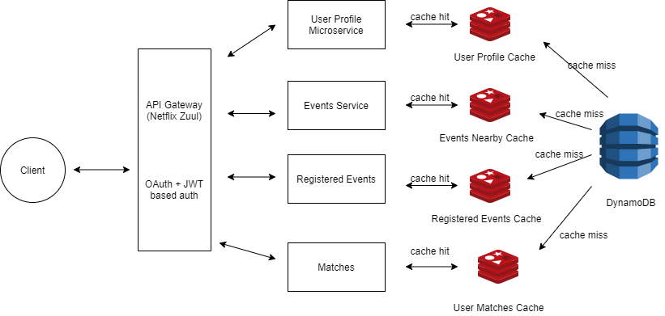

**Stagged**  
Dating Website which find matches in all the events happening near you.

**Netfix Zuul Gateway and JWT token based authentication**  
Implemented JWT based authentication in spring boot and integrated with Netflix Zuul (Gateway Service) 

**Stagged Design**  

**Implementaiton**  

1) This is a gateway service which checks for token everytime before proceeding the request for any microservice.
2) We have used AWS Dynamo to store user and events information. Microservices will hit the redis cache for any query. If there is a miss, we will directly query the dynamo tables and add the details in redis. 
3) Every microservice is running in different docker containers, which helps the application to scale-up easily.

